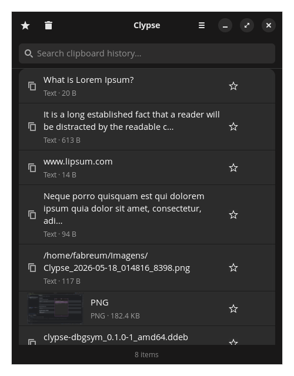
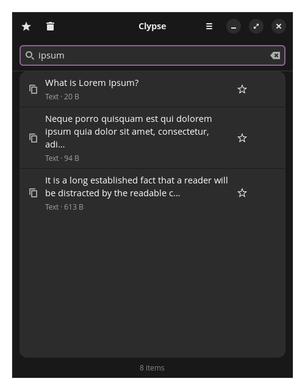
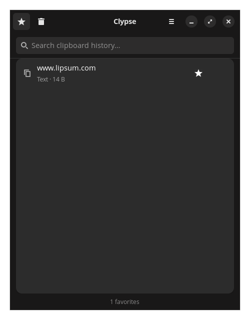
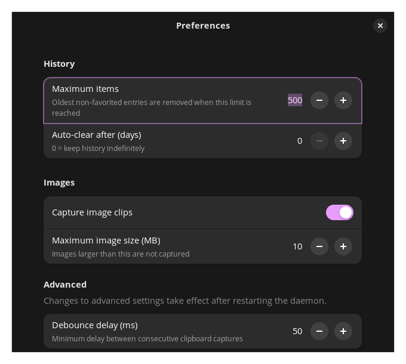

# Clypse

**Clypse** is a fast, native clipboard manager for Linux built with Rust, GTK4, and libadwaita. It uses the `zwlr-data-control-v1` Wayland protocol for event-driven clipboard monitoring — no polling, no overhead.

Designed for GNOME and COSMIC desktops, compatible with any Wayland compositor that implements wlr-data-control.

[](https://skillicons.dev)


---

## Screenshots

| History | Search |
|:---:|:---:|
|  |  |

| Favorites | Preferences |
|:---:|:---:|
|  |  |

---

## Features

- **Persistent history** — SQLite with WAL mode, survives reboots
- **Full-text search** — FTS5 index, instant filtering as you type
- **Image capture** — stores PNG, JPEG, and WebP clipboard images with thumbnail preview
- **Favorites** — starred items are never auto-deleted
- **Hash-based deduplication** — no duplicate entries
- **Auto-paste** — click an item to copy it; Clypse attempts to paste automatically via `wtype`, `ydotool`, or `xdotool`
- **System tray icon** — SNI tray with quick Show/Quit access (GNOME, COSMIC, KDE)
- **COSMIC panel applet** — native libcosmic applet with quick history popup and search
- **Preferences dialog** — configure history limit, image capture, auto-clear, and more
- **systemd user service** — starts on login, sd_notify watchdog integration
- **Native GTK4/libadwaita UI** — follows GNOME/COSMIC HIG

---

## Installation

### Development install (no root required)

```bash
make dev-install    # builds + installs to ~/.local/bin, registers systemd service
make enable         # starts the daemon and enables it on login
clypse              # opens the interface
```

To remove:
```bash
make dev-uninstall
```

### System install (requires root)

```bash
make build
sudo make install
```

### .deb package (Ubuntu / Pop!_OS / Debian)

```bash
make deb
sudo dpkg -i ../clypse_*.deb
sudo apt install -f
```

---

## Usage

After `make enable`, the daemon runs in the background. Launch `clypse` to open the clipboard history window.

**Recommended shortcut** — bind `clypse` to `Super+V` in your compositor's keyboard settings for a Windows+V style workflow.

| Action | How |
| --- | --- |
| Copy item | Click any row |
| Search history | Start typing in the search bar |
| Favorite an item | Click the ☆ icon on any row |
| Filter favorites | Click the ★ button in the header |
| Delete an item | Hover over the row, click the trash icon |
| Clear all history | Click the trash button in the header bar |
| Open preferences | ☰ → Preferences |
| Dismiss window | Press `Escape` |

**Tray icon** — Clypse runs a system tray icon; right-click it to show the window or quit the application.

---

## Configuration

Settings are saved automatically and stored at `~/.config/clypse/config.toml`.

| Setting | Default | Description |
| --- | --- | --- |
| Maximum items | 500 | Oldest non-favorited entries are removed when this limit is reached |
| Auto-clear after (days) | 0 | Remove entries older than N days (0 = keep indefinitely) |
| Capture image clips | On | Store images copied to the clipboard |
| Maximum image size (MB) | 10 | Images larger than this limit are not captured |
| Debounce delay (ms) | 50 | Minimum delay between consecutive captures; takes effect after daemon restart |

---

## Requirements

- Rust 1.75+ (for build)
- GTK4 + libadwaita (`libgtk-4-dev`, `libadwaita-1-dev`)
- SQLite 3 (`libsqlite3-dev`)
- A Wayland compositor with `zwlr-data-control-v1` support (GNOME, COSMIC, Sway, etc.)
- Optional: `wtype`, `ydotool`, or `xdotool` for auto-paste

---

## Architecture

```
clypse-daemon   Wayland listener + SQLite + IPC server (Unix socket)
clypse          GTK4/libadwaita GUI + IPC client
clypse-applet   COSMIC panel applet (libcosmic) + IPC client
```

The daemon runs as a systemd user service and communicates with the GUI over a Unix socket using a newline-delimited JSON protocol. The GUI connects on launch and reconnects automatically on disconnect.

---

## License

GPL-3.0
